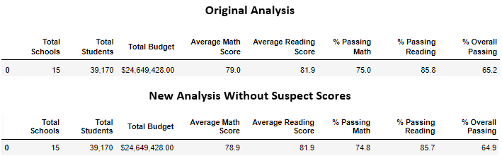
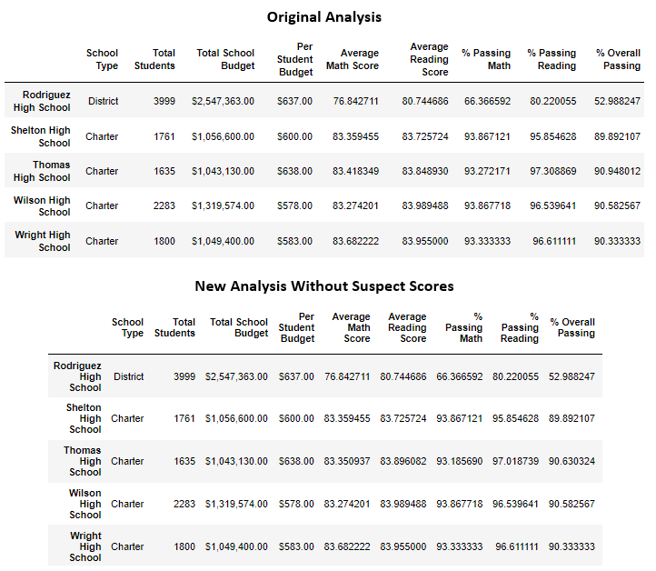
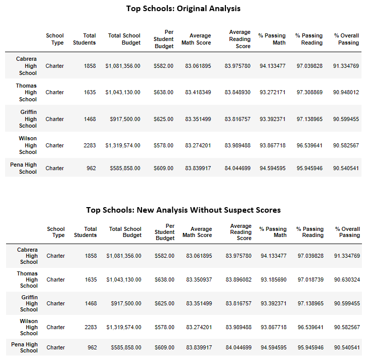
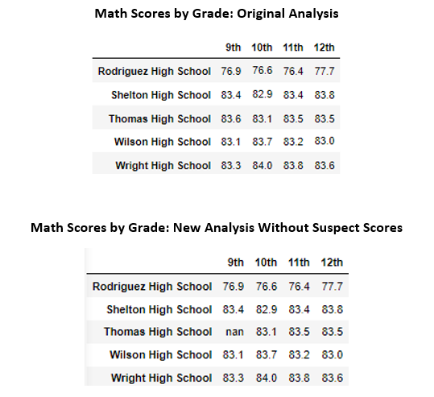
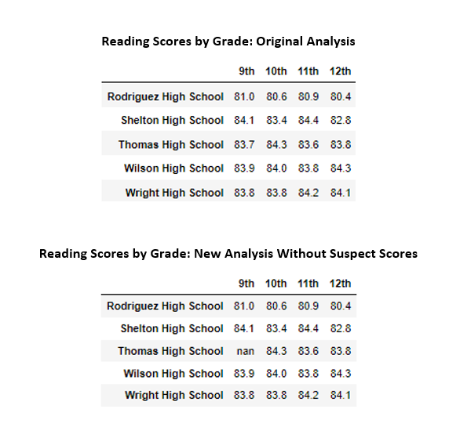
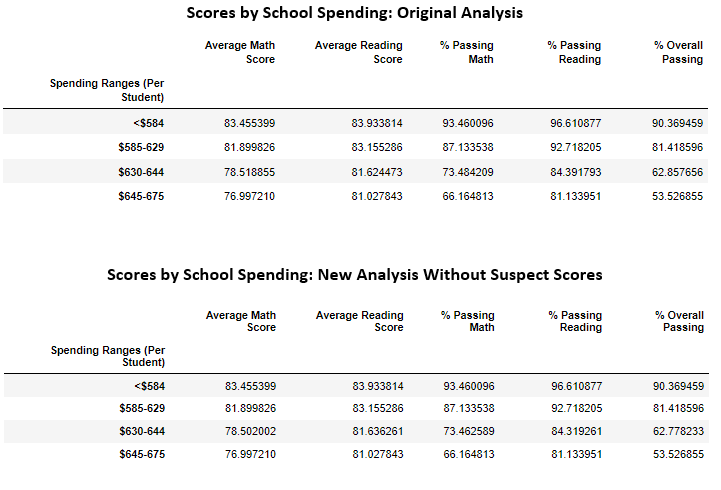
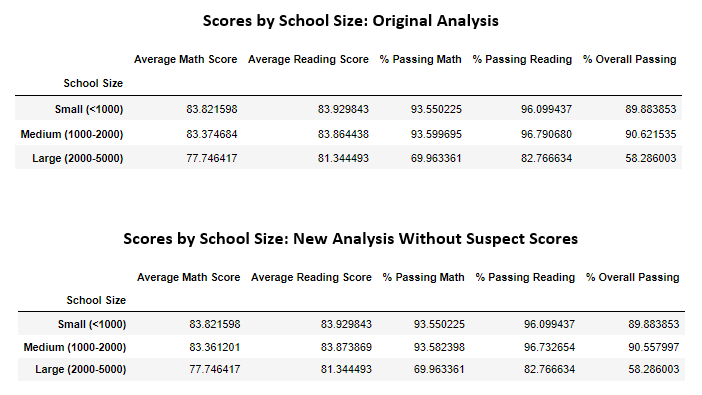
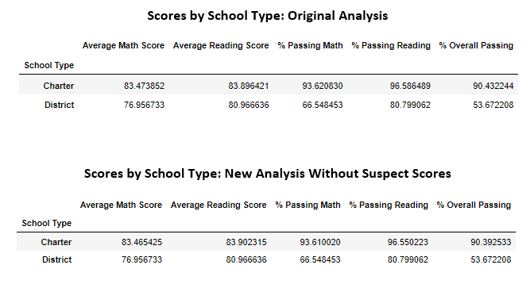

# PyCity Schools

## Overview of Project
### Purpose
After completing the initial PyCity Schools analysis, it was brought to our attention that some of the data's integrity was in question. Maria and her supervisor tasked us with updating our analysis by replacing all of the 9th grade scores from Thomas High School with null values. We were then asked to repeat our analysis without the suspect data affecting the outcomes. Finally, we were asked to compare the two analyses and document any changes in the results due to the updated analysis.

## Results
### Comparisons of Analyses

After replacing all the 9th Grader scores from Thomas High School with "NaN" values and effectively removing their impact on the analysis, we were able to document the following changes:
   
   - In the District Summary, the analysis replacing the suspect scores found
        - Average Math scores in the district fell by .1 
        - Average Reading scores had little change
        - The percentage of students who passed Math decreased by .2%
        - The percentage of students who passed Reading decreased by .1%
        - The percentage of students who passed both subjects fell by .3%
        

        
   - The school summary gave us insight on the direct impact removing the 9th grade scores had on Thomas High School's average scores and percentages
        - Average Math scores in the school fell by nearly .07 points
        - Average Reading scores increased by close to .05 points
        - The percentage of students who passed Math decreased by almost .1%
        - The percentage of students who passed Reading decreased by roughly .3%
        - The percentage of students who passed both subjects fell by .3%
        
 
        
  - Removing the statistical significance of Thomas High School's 9th grade scores had a slight impact on how they performed compared to other scores. While retaining the second spot on the districts top performers list when comparing the number of students passing both subjects, their .35% edge over Griffin Highschool reduced to only .03%, rendering it a near statistical tie.
  

        
   - The Math and Reading Scores by Grades were directly affected by the replacement of 9th grade scores. These DataFrames point out exactly which data sets have been ommited from the analysis while keeping all of the other data sets intact.
 

        

        
   - In the Scores by School Spending analysis, we saw the following changes in the $630-644 per student bin
        - Average Math scores in the bin decreased by almost .02 points 
        - Average Reading scores decreased by .02 points
        - The percentage of students who passed Math decreased by .02%
        - The percentage of students who passed Reading decreased by .07%
        - The percentage of students who passed both subjects fell by .06%
    

   - The impact made to the Scores by School Size analysis was also fairly minimal. The following changes occured in the medium school size bin
        - Average Math scores in the bin decreased by roughly .01 points 
        - Average Reading scores increased by nearly .01 points
        - The percentage of students who passed Math decreased by .02%
        - The percentage of students who passed Reading decreased by .06%
        - The percentage of students who passed both subjects fell by .06%
        

        
   - Finally, the changes in the Scores by school type were also slightly down in the Charter school bin
        - Average Math scores in the bin decreased by almost .01 points 
        - Average Reading scores increased by nearly .01 points
        - The percentage of students who passed Math decreased by .01%
        - The percentage of students who passed Reading decreased by almost .03%
        - The percentage of students who passed both subjects fell by .04%
        

## Summary
Performing the analysis after ommitting the scores from the 9th graders at Thomas High School revealed that replacing data can have an impact on a data set as a whole and the analysis using that data. The summary that had the most glaring and isolated change was the analysis of Scores by Grades. This was the only summary that displayed our null values. Some of the changes, like the .3% decrease in the students that passed both classes observed in both the district and school summaries, may have a significant impact on interpretiing the analyses. Other changes, such as the .01-.03% decreases in the analyses that involved putting the data in bins, have less of a statistical impact. Despite most of the changes being fairly small, .01% of this data still represents roughly 4 children and their scores. While there isn't a total shift in narative told by removing compromised data, it is important that we keep our data's integrity as clean as possible.  
    
